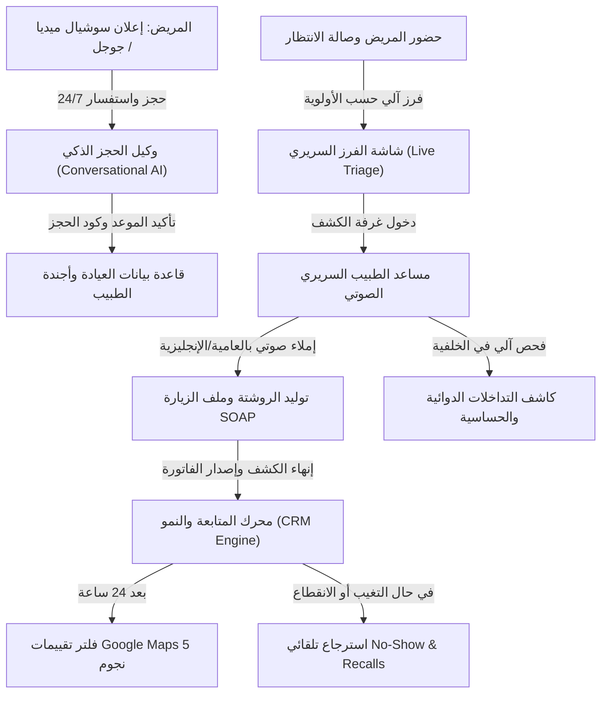

# 📘 الملف الاستراتيجي المتكامل: منظومة الذكاء الاصطناعي السريري والإداري (ClinicFlow AI Suite)
> **دليل الجدوى التشغيلية، المعمارية الفنية، واقتصاديات التكلفة والعائد للأطباء والمراكز الطبية**  
> **إعداد:** قطاع تطوير المنتجات واستراتيجيات الأعمال الطبية — ClinicFlow  
> **الإصدار:** Enterprise v2.0 — سبتمبر 2026

---

## 🎯 1. الرؤية والمفهوم التجاري (The Commercial Value Proposition)

في قطاع الرعاية الصحية الخاصة، لا يشتري الطبيب أو المستثمر "تقنيات ذكاء اصطناعي" لمجرد التحديث؛ بل يشتري **ثلاثة عوائد استثمارية مباشرة**:

1. **تفريغ وقت الطبيب للتركيز على الكشف:** تقليل الوقت المستغرق في التدوين المكتبي بنسبة **45%** عبر الإملاء الصوتي والتلخيص السريري الآلي.
2. **منع تسريب الإيرادات (Revenue Recovery):** استعادة ما لا يقل عن **60% من المواعيد الضائعة (No-Shows)** وتنشيط المرضى المنقطعين عبر قنوات التواصل الذاتية.
3. **أتمتة خدمة المرضى على مدار الساعة (24/7):** حجز فوري واستجابة دقيقة لاستفسارات المرضى دون الاعتماد الحصري على مواعيد دوام موظفي الاستقبال.

---

## 🔄 2. رحلة الذكاء الاصطناعي المتكاملة داخل العيادة (End-to-End AI Workflow)



---

## 🧩 3. المعمارية الفنية ومصفوفة النماذج (Multi-Tier Model Architecture)

تعتمد المنظومة على **معمارية هجينة موزعة (Tiered Model Routing)** لضمان أقل زمن استجابة وأعلى دقة سريرية بأقل تكلفة ممكنة:

```
                                 [واجهة الطبيب / بوابة المريض]
                                               │
                                               ▼
                              [بوابة الحماية والفلترة API Gateway]
                              • تجريد الهوية الشخصية (PII Masking)
                              • توجيه المهام حسب الصعوبة (Intent Router)
                                /              |              \
                               /               |               \
                              ▼                ▼                ▼
                     [Tier 1: اللحظي السريع]   [Tier 2: الاستدلال السريري]  [Tier 3: المعالجة الصوتية]
                        Gemini 2.5 Flash            Claude 3.5 Sonnet            Whisper Large-v3
                     (حجز، استعلامات، فلاتر)       (تعارض أدوية، تشخيصات)       (تحويل الصوت إلى نص)
```

### المقارنة الفنية والتشغيلية بين النماذج المعتمدة:

| مستوى المعالجة | النموذج المعتمد | الوظيفة الأساسية داخل العيادة | زمن الاستجابة | تكلفة المليون توكن (مدخلات / مخرجات) |
|---|---|---|---|---|
| **Tier 1: المحرك السريع** | **Google Gemini 2.5 Flash**<br>*(بديل: GPT-4o-mini)* | • حجز المواعيد والإجابة على الاستفسارات.<br>• حظر وتعديل الجداول واستعلامات الفرز.<br>• صياغة رسائل المتابعة والتذكير. | **< 450ms** | **$0.10** / **$0.40**<br>(تكلفة لا تُذكر) |
| **Tier 2: الذكاء السريري** | **Claude 3.5 Sonnet**<br>*(بديل: DeepSeek-V3 / GPT-4o)* | • كشف التداخلات والتعارضات الدوائية المعقدة.<br>• تلخيص التاريخ المرضي التراكمي للمريض.<br>• توليد تقارير الإحالة الطبية. | **1.2s - 1.8s** | **$0.25 - $3.00** / **$1.10 - $15.00** |
| **Tier 3: الصوت الطبي** | **Whisper Large-v3**<br>*(عبر Groq / Azure)* | • تحويل كلام الطبيب السريع أثناء الكشف إلى نص منظم ومصنف في ملف المريض. | **لحظي (Streaming)** | **$0.006** لكل دقيقة صوتية |

---

## 📊 4. هندسة التوكنز واقتصاديات الحجم (Tokenomics & Unit Consumption)

### أ. ما هو حجم استهلاك العملية السريرية الواحدة؟
*في اللغة العربية، الكلمة الواحدة = تقريباً 1.5 إلى 2 توكن (Tokens):*

| نوع العملية السريرية | حجم المدخلات (Prompt + Context) | حجم المخرجات (AI Generation) | إجمالي التوكنز للعملية |
|---|---|---|---|
| **فحص تعارض الروشتة والأدوية** | 350 توكن (الأدوية + الأمراض المزمنة) | 150 توكن (تقرير الأمان والتحذير) | **~ 500 توكن** |
| **تلخيص وإملاء الكشف (SOAP Note)** | 300 توكن (كلام الطبيب الخام) | 200 توكن (الشكوى، التشخيص، الخطة) | **~ 500 توكن** |
| **استعلام إداري أو أمر للطبيب** | 500 توكن (سياق العيادة + السؤال) | 150 توكن (الرد وتحديث الأجندة) | **~ 650 توكن** |
| **صياغة رسالة متابعة أو استرجاع غائب** | 200 توكن (بيانات الموعد والخدمة) | 100 توكن (نص الرسالة المخصص) | **~ 300 توكن** |
| **استفسار مريض مع شات بوت الحجز** | 400 توكن (الأسعار والمواعيد المتاحة) | 150 توكن (الإجابة ورابط الحجز) | **~ 550 توكن** |

---

### ب. محاكاة استهلاك العيادات شهرياً بالأرقام الدقيقة:

```
┌────────────────────────────────────────────────────────────────────────────────────────┐
│                        مصفوفة الاستهلاك الشهري حسب حجم المنشأة                          │
├─────────────────────────┬─────────────────────────┬────────────────────────────────────┤
│ حجم المنشأة             │ معدل العمليات شهرياً    │ حجم التوكنز الإجمالي الشهري         │
├─────────────────────────┼─────────────────────────┼────────────────────────────────────┤
│ عيادة فردية متوسطة     │ 1,200 عملية ذكاء اصطناعي│ 0.65 مليون توكن (~650K Tokens)    │
│ عيادة نشطة / تخصصية     │ 2,700 عملية ذكاء اصطناعي│ 1.45 مليون توكن (~1.45M Tokens)   │
│ مركز طبي (5 عيادات)    │ 7,500 عملية ذكاء اصطناعي│ 3.80 مليون توكن (~3.80M Tokens)   │
└─────────────────────────┴─────────────────────────┴────────────────────────────────────┘
```

#### تفصيل استهلاك العيادة الفردية المتوسطة (20 كشفاً يومياً / 500 كشف شهرياً):
* فحص تعارضات الأدوية (500 كشف): **250,000 توكن**.
* تدوين وتلخيص كشوفات جديدة (250 حالة): **125,000 توكن**.
* أوامر الطبيب واستعلامات المواعيد (120 استعلام): **80,000 توكن**.
* رسائل استرجاع المواعيد والـ CRM (80 حالة): **25,000 توكن**.
* شات بوت الحجز واستفسارات المرضى (300 محادثة): **165,000 توكن**.
* **المجموع الشهري الفعلي:** **~ 645,000 توكن (أقل من ثلثي مليون توكن!)**.

---

### ج. التكلفة التشغيلية المباشرة (Direct Operational Cost - COGS):

باستخدام النموذج الرئيسي **Gemini 2.5 Flash** مع دعم **Whisper** الصوتي:

| حجم المنشأة | حجم التوكنز الشهري | تكلفة استهلاك النصوص ($) | تكلفة الإملاء الصوتي ($) | إجمالي التكلفة بالدولار | إجمالي التكلفة بالجنيه (سعر 50 ج.م) |
|---|---|---|---|---|---|
| **عيادة فردية عادية** | 0.65 M | $0.18 | $0.60 (100 دقيقة) | **$0.78** | **~ 39.00 ج.م / شهرياً** |
| **عيادة نشطة مزدحمة** | 1.45 M | $0.42 | $1.20 (200 دقيقة) | **$1.62** | **~ 81.00 ج.م / شهرياً** |
| **مركز طبي (5 عيادات)** | 3.80 M | $1.15 | $3.60 (600 دقيقة) | **$4.75** | **~ 237.50 ج.م / شهرياً** |

> 💡 **الخلاصة المالية:**  
> حتى مع استخدام العيادة لأعلى معدلات الاستعلام والإملاء الصوتي، **فإن التكلفة التحتية المباشرة لا تتجاوز 40 إلى 85 جنيهاً مصرياً شهرياً للعيادة الواحدة!**

---

## 🔒 5. حوكمة البيانات وأمان المرضى (Data Governance & Medical Liability)

لكسب ثقة كبار الأطباء والمراكز الاستثمارية، تم تضمين ثلاث ركائز حماية صارمة:

1. **تجريد وتشفير الهوية (PII Sanitization Layer):**  
   يقوم النظام داخلياً بتشفير اسم المريض، رقمه القومي، ورقم هاتفه، واستبدالها بمعرف رقمي مؤقت `[PATIENT_HASH_ID]` قبل إرسال السياق السريري للموديل، فلا تخرج أي بيانات شخصية خارج الخادم.
2. **اتفاقية عدم تدريب النماذج (Zero Data Retention):**  
   الاتصال عبر واجهات الـ Enterprise API (Google Vertex AI / Azure OpenAI) يضمن قانونياً عدم استخدام مدخلات العيادة في تدريب نماذج الذكاء الاصطناعي العامة.
3. **التدقيق السريري الصارم (Human-in-the-Loop):**  
   لا يتم اعتماد أي روشتة أو تشخيص أو تغيير موعد تلقائياً دون **موافقة الطبيب النهائية بضغطة زر**، مما يعفي المنظومة من أي مسؤولية تشخيصية مباشرة.

---

## 💼 6. النموذج التجاري وهيكل الباقات (Commercial Packaging & Margins)

### هيكل الباقات المعتمد للطرح التجاري:

```
┌─────────────────────────┐   ┌─────────────────────────┐   ┌─────────────────────────┐
│       Core System       │   │      ClinicFlow AI      │   │    Enterprise Center    │
│      (المنظومة الأساسية)    │   │      (الباقة الذكية الشاملة)  │   │     (المراكز والمستشفيات)   │
├─────────────────────────┤   ├─────────────────────────┤   ├─────────────────────────┤
│ • إدارة المواعيد والأجندة │   │ • كافة مميزات Core      │   │ • كافة مميزات AI        │
│ • صالة الانتظار الحية   │   │ • مساعد الطبيب الصوتي AI│   │ • نماذج مخصصة للتخصصات    │
│ • ملفات المرضى والفواتير │   │ • كاشف تعارض الأدوية     │   │ • دعم فني مخصص 24/7     │
│ • تسليم وردية الخزينة    │   │ • شات بوت الحجز الذكي    │   │ • خوادم معزولة وSLA 99.9%│
│ ————————————————        │   │ • رصيد 2M توكن شهرياً    │   │ • رصيد 10M توكن شهرياً   │
├─────────────────────────┤   ├─────────────────────────┤   ├─────────────────────────┤
│    600 ج.م / شهرياً     │   │   1,200 ج.م / شهرياً    │   │   2,500 ج.م / للعيادة   │
└─────────────────────────┘   └─────────────────────────┘   └─────────────────────────┘
```

### تحليل ربحية باقة الذكاء الاصطناعي (ClinicFlow AI):
* **سعر الاشتراك الشهري للباقة:** 1,200 ج.م
* **سعر المنظومة التقليدية بدون AI:** 600 ج.م
* **القيمة المضافة المحصلة للـ AI:** **600 ج.م شهرياً**
* **التكلفة التشغيلية الفعلية (COGS):** ~50 ج.م شهرياً (توكنز + صوت + خوادم)
* **صافي الربح الشهري المباشر من الـ AI:** **550 ج.م شهرياً لكل عيادة**
* **هامش الربح الإجمالي (Gross Margin):** **91.6%**

---

## 📈 7. معادلة عائد الاستثمار للطبيب (ROI Proof to Clinic Owners)

عند الاجتماع مع إدارة المركز الطبي، يُعرض العائد المالي بدقة:

$$\text{العائد المالي المباشر} = \text{قيمة الكشوفات المستردة} + \text{قيمة استكمال الباقات} - \text{تكلفة الاشتراك}$$

* **المواعيد المستعادة (No-Show Recovery):** استعادة 4 كشوفات أسبوعياً فقط (4 × 300 ج.م = 1,200 ج.م أسبوعياً) ➔ **+4,800 ج.م شهرياً**.
* **باقات الجلسات المستكملة:** متابعة حالتين شهرياً منعتا من الانقطاع (2 × 1,500 ج.م) ➔ **+3,000 ج.م شهرياً**.
* **إجمالي الدخل الإضافي المسترد للعيادة:** **+7,800 ج.م شهرياً** مقابل اشتراك قدره **1,200 ج.م**.
* **عائد الاستثمار الفعلي (ROI):** **650% (أي أن النظام يرد تكلفته 6.5 أضعاف شهرياً)**.

---

## 🗓️ 8. خطة الإطلاق والتشغيل التجريبي (30-Day Launch Plan)

1. **الأسبوع 1: الإعداد السحابي والحماية:** ضبط واجهة برمجة التطبيقات (OpenRouter / Google Vertex) وتفعيل طبقة حجب البيانات الشخصية (PII Masking).
2. **الأسبوع 2: تفعيل المساعد السريري:** ربط كاشف تعارض الأدوية، والإملاء الصوتي للروشتة في شاشة الكشف.
3. **الأسبوع 3: برنامج الديمو التجريبي (Pilot Cohort):** تشغيل 3 عيادات رائدة وجمع الملاحظات السريرية الفعلية.
4. **الأسبوع 4: الطرح التجاري الكامل:** بدء حملات التسويق والمبيعات وتفعيل باقة **ClinicFlow AI**.

---
**وثيقة معتمدة للتخطيط التجاري والتشغيلي — ClinicFlow Enterprise**
