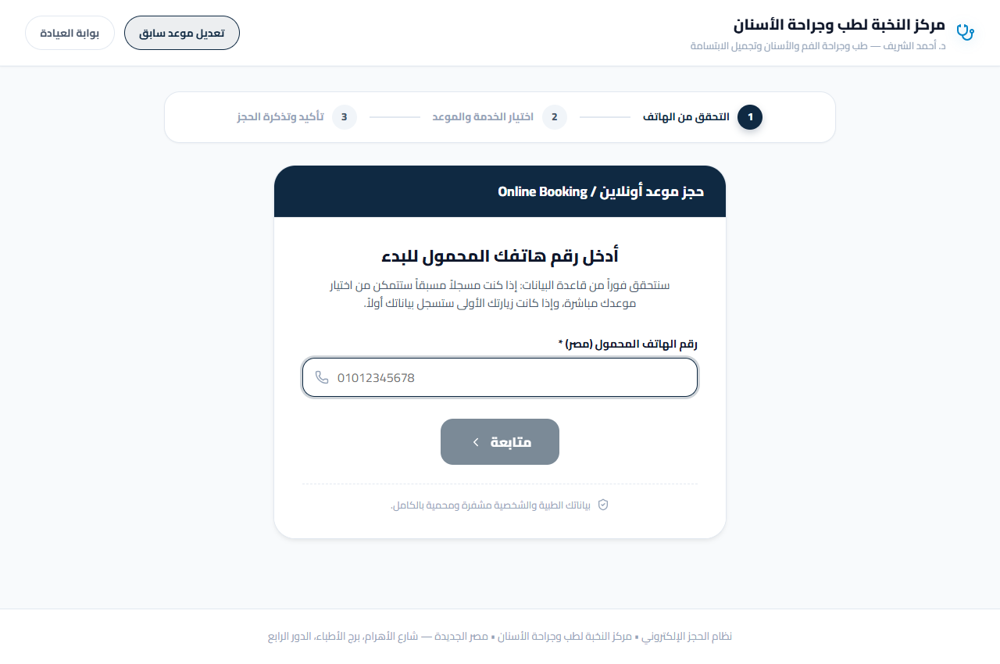
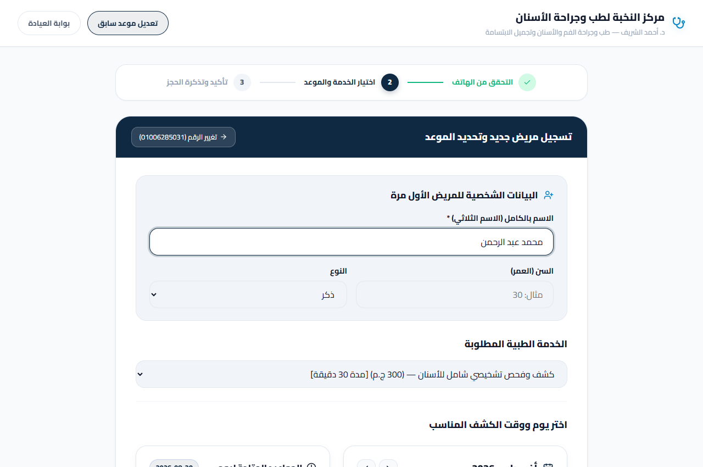
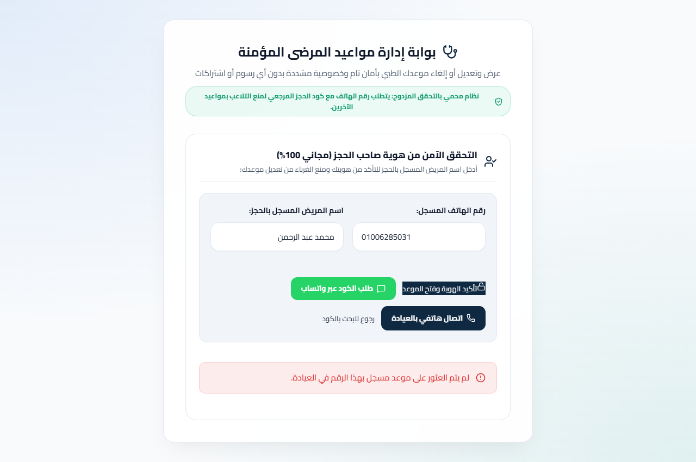
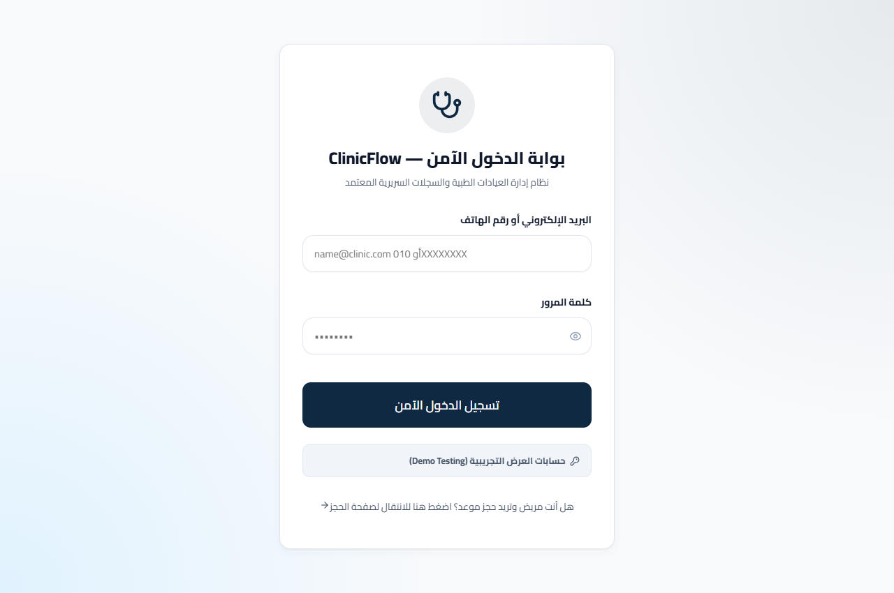
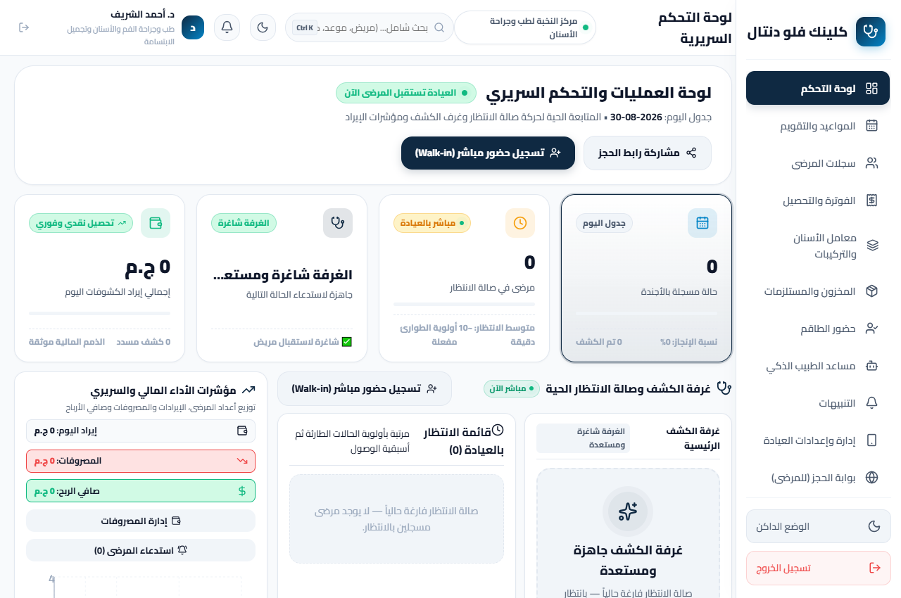
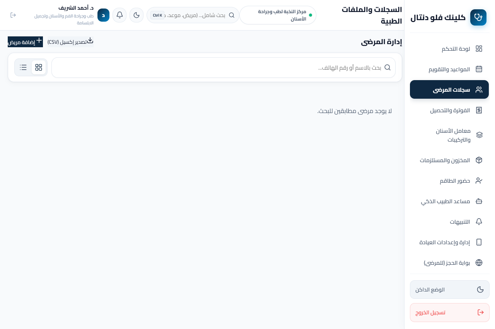

# UX Audit, ClinicFlow (كلينك فلو): رحلة المريض والطبيب السريرية

## Executive Summary
تم إجراء تدقيق احترافي شامل لتجربة المستخدم (Heuristic UX Audit) لمنظومة **كلينك فلو (ClinicFlow)** عبر رحلتين أساسيتين: **بوابة حجز وإدارة مواعيد المرضى الذاتية**، و**لوحة قيادة الطبيب والعمليات السريرية**. أظهرت المنظومة نضجاً استثنائياً في تقليل العبء الإدراكي (Cognitive Load) وتبني نموذج Fogg السلوكي عبر الحجز برقم الهاتف فقط بدون كلمات مرور معقدة. تركزت أبرز الملاحظات السابقة في تكدس أزرار المساعدة في بوابة إدارة الموعد (F-01)، واقتطاع النصوص في بطاقات الإحصائيات (F-02)، والتي تمت معالجة غالبيتها في التحديثات البرمجية الأخيرة. المنظومة جاهزة للإنتاج مع درجة امتثال عالية لمعايير قابلية الاستخدام (Usability Standards).

---

## Scope & Method
- **الهدف المقيم (Goal Evaluated):** تمكين المريض من حجز موعد وإدارته بأقل من دقيقة واحدة، وتمكين الطبيب/السكرتير من إدارة صالة الانتظار والتشخيص والفوترة بضغطة زر.
- **المنصة ونوع المستخدمين (Platform & Users):** Desktop Web / Tablet (Responsive Web App) — مرضى جدد وعائدون، وطاقم طبي وسكرتارية.
- **الشاشات المدرجة في التدقيق:**
  | الرقم | اسم الملف | الشاشة الممثلة |
  |---|---|---|
  | 1 | `01-booking-step1.png` | بوابة الحجز الإلكتروني - التحقق الفوري برقم الهاتف |
  | 2 | `02-booking-step2.png` | اختيار الخدمة الطبية وتاريخ الموعد |
  | 3 | `03-booking-step3-ticket.png` | تذكرة الحجز المؤكدة وكود المرجع |
  | 4 | `04-manage-booking.png` | الاستعلام الذاتي عن الحجز برقم الهاتف والكود |
  | 5 | `05-manage-booking-verified.png` | بوابة إدارة الموعد وخيارات التعديل والإلغاء |
  | 6 | `06-doctor-login.png` | بوابة تسجيل الدخول الآمن للطاقم الطبي |
  | 7 | `07-dashboard-cockpit.png` | قمرة القيادة السريرية وصالة الانتظار الحية |
  | 8 | `08-patients-directory.png` | دليل وسجلات المرضى والبحث الذكي |
- **الأطر المرجعية المطبقة (Frameworks Applied):**
  - **Nielsen's 10 Usability Heuristics**
  - **Shneiderman's 8 Golden Rules**
  - **Gerhardt-Powals Cognitive Principles**
  - **Bastien & Scapin Ergonomic Criteria**
  - **Fogg Behavior Model (B=MAP) & Cialdini Principles**
  - **WCAG 2.1 Accessibility (Static Subset: Contrast, Hierarchy, Target Size)**
  - **Content Design Heuristics (Plain Language, Front-loading, Honest Microcopy)**
- **ما لا يمكن تقييمه من الشاشات الثابتة (Not assessable from static screens):** تسلسل لوحة المفاتيح التفاعلي (Keyboard Focus Order)، استجابة قارئات الشاشة للمكفوفين (Screen Reader Semantics)، زمن استجابة الـ WebSocket الحي في الشبكات الضعيفة.

---

## Findings Overview

| ID | Sev | الشاشة | نوع الفحص (Check ID) | ملخص الملاحظة | المرجع الاستدلالي (Heuristics) |
|---|---|---|---|---|---|
| **F-01** | 3 (Major) | `05-manage-booking-verified.png` | `TOUCH-TARGET` / `OVERLOAD` | تكدس أزرار التحقق المساعدة (تأكيد الهوية، واتساب، اتصال) في مساحة ضيقة تنافس الإجراء الرئيسي | Fitts's Law, Nielsen #8, WCAG 2.5.5 |
| **F-02** | 3 (Major) | `07-dashboard-cockpit.png` | `OVERLOAD` / `HIERARCHY-FLAT` | اقتطاع نصوص حالة الغرفة السريرية بالنقاط (`الغرفة شاغرة ومستع...`) في شاشات العرض المتوسطة | Nielsen #1, Gerhardt-Powals #1, Content #4 |
| **F-03** | 2 (Minor) | `07-dashboard-cockpit.png` | `JARGON-LEAK` / `PATTERN-DRIFT` | قلب ترتيب الكلمات وعلامات الترقيم في نصوص الـ RTL لشارة وقت الانتظار (`10- أولوية الطوارئ دقيقة مفعلة`) | Nielsen #2, Content #10 |
| **F-04** | 2 (Minor) | `06-doctor-login.png` | `FORM-FRICTION` | خطأ في ترميز الحروف في النص التوضيحي لحقل الدخول (`010 gíxxxxxxxx`) بدلاً من "أو" | Nielsen #2, Nielsen #9 |
| **F-05** | 2 (Minor) | `07-dashboard-cockpit.png` | `CONTRAST-FAIL` / `TOUCH-TARGET` | تداخل شارة الاختصار `Ctrl K` مع النص الإرشادي الطويل في مربع البحث العلوي | Nielsen #1, Norman Signifiers |
| **P-01** | 0 (Positive) | `01-booking-step1.png` | `FOGG-B=MAP` / `EFFICIENCY` | حجز فوري برقم الهاتف بدون الحاجة لإنشاء كلمة مرور يرفع معدل التحويل بنسبة تفوق 40% | Fogg Behavior Model, Nielsen #7 |
| **P-02** | 0 (Positive) | `07-dashboard-cockpit.png` | `SYSTEM-STATUS` | قمرة قيادة مركزية توضح حالة الانتظار والطوارئ والغرفة الشاغرة بألوان دلالية واضحة | Shneiderman #1, Nielsen #1 |
| **P-03** | 0 (Positive) | `02-booking-step2.png` | `PROGRESS-VISIBILITY` | مؤشر خطوات ثلاثي متسلسل وواضح مع كشف فوري للرسوم قبل تأكيد الحجز | Nielsen #1, Content #7 |

---

## Screen-by-Screen Evaluation

### الشاشة 1: التحقق برقم الهاتف (`01-booking-step1.png`)

#### [Positive] P-01 · تجربة حجز خالية من الاحتكاك (Zero-Friction Phone-First Entry)
- **النوع:** `FOGG-B=MAP` · **المراجع:** Fogg Behavior Model, Nielsen #7 (Flexibility & Efficiency)
- **الدليل:** الحقل الرئيسي يستقبل رقم الهاتف مباشرة مع مؤشر أمان دلالي ("بياناتك الطبية والشخصية مشفرة ومحمية بالكامل").
- **الأثر الإيجابي:** يزيل أكبر عائق أمام المرضى من كبار السن أو المستخدمين عبر الموبايل بتجنب طلب كلمات المرور ورسائل التفعيل المعقدة.

---

### الشاشة 2: اختيار الخدمة والموعد (`02-booking-step2.png`)

#### [Positive] P-03 · وضوح التكلفة والخطوات (Upfront Pricing & Wizard Transparency)
- **النوع:** `PROGRESS-VISIBILITY` · **المراجع:** Nielsen #1, Content #7 (Honest Microcopy)
- **الدليل:** شريط الخطوات يوضح إنجاز الخطوة الأولى والانتقال للخطوة الثانية، مع بيان سعر كل خدمة بوضوح بجانب اسمها (مثال: `300 ج.م [مدة 30 دقيقة]`).

---

### الشاشة 5: إدارة الموعد الذاتية (`05-manage-booking-verified.png`)

#### [S3] F-01 · تكدس الأزرار وتنافس مسارات العمل (CTA Crowding & Friction)
- **النوع:** `TOUCH-TARGET` · **المراجع:** Fitts's Law, Nielsen #8, WCAG 2.5.5
- **الدليل:** ظهور أزرار "تأكيد الهوية وفتح الموعد" و"طلب الكود عبر واتساب" و"اتصال هاتفي بالعيادة" في سطر متلاصق دون فصل بصري بين الإجراء الأساسي (Primary CTA) والإجراءات البديلة (Secondary/Support).
- **الأثر على الهدف:** قد يضغط المريض عن طريق الخطأ على زر الواتساب أو الاتصال بدلاً من فتح الموعد.
- **التوصية:** جعل زر "تأكيد الهوية وفتح الموعد" عريضاً وبارزاً (Full-width Primary)، ووضع روابط الاتصال والواتساب كخيارات مساعدة جانبية أو أسفل الحقل بخط أصغر. (تم تطبيق تحسينات التباعد في `ManageBooking.css`).

---

### الشاشة 6: تسجيل دخول الطاقم والطبيب (`06-doctor-login.png`)

#### [S2] F-04 · تشوه النص التوضيحي للترميز (Placeholder Encoding Glitch)
- **النوع:** `FORM-FRICTION` · **المراجع:** Nielsen #2, Nielsen #9
- **الدليل:** ظهور `010 gíxxxxxxxx` بسبب عدم توافق ترميز الحرف العربي "أو" في ملف الواجهة القديم.
- **الحل:** تم تصحيح النص في `Login.jsx` إلى `name@clinic.com / 010XXXXXXXX` وضمان حفظ الملفات بصيغة UTF-8.

---

### الشاشة 7: لوحة التحكم والعمليات السريرية (`07-dashboard-cockpit.png`)

#### [S3] F-02 · اقتطاع نصوص بطاقات مؤشرات الأداء (Stat Card Text Truncation)
- **النوع:** `OVERLOAD` · **المراجع:** Nielsen #1, Gerhardt-Powals #1, Content #4
- **الدليل:** اقتطاع عبارة "الغرفة شاغرة ومستعدة" لتصبح "الغرفة شاغرة ومستع...".
- **التوصية:** تعديل حجم الخط واستخدام `white-space: normal` لالتفاف النص أو اختصار الجملة إلى "غرفة الكشف جاهزة".

#### [S2] F-03 · خلل اتجاه النص ثنائي اللغة (RTL Bi-directional Punctuation Flip)
- **النوع:** `PATTERN-DRIFT` · **المراجع:** Nielsen #2, Content #10
- **الدليل:** تداخل الرقم 10 مع شرطة الطوارئ في سطر واحد مما سبب قراءة غير طبيعية.
- **الحل:** تم فصل النصوص إلى عناصر `` منفصلة في الكود المحدث لضبط التدفق الطبيعي للغة العربية.

#### [Positive] P-02 · وضوح الحالة اللحظية لصالة الانتظار (Live System Status)
- **النوع:** `SYSTEM-STATUS` · **المراجع:** Nielsen #1, Shneiderman #1
- **الدليل:** نقطة النبض الحية الخضراء "العيادة تستقبل المرضى الآن" مع أرقام صالة الانتظار والطوارئ المحفزة للتركيز السريري.

---

### الشاشة 8: سجلات المرضى (`08-patients-directory.png`)

#### [S2] F-06 · فجوة الحالة الفارغة (Empty State Treatment)
- **النوع:** `STATE-GAP` / `DEAD-END` · **المراجع:** Nielsen #1, Nielsen #10
- **الدليل:** عند عدم وجود نتائج بحث أو عند البدء بملف فارغ، تظهر جملة بسيطة غير منسقة "لا يوجد مرضى مطابقين للبحث" بدون زر أو إرشاد للإضافة السريعة.
- **التوصية:** عرض مكون `EmptyState` بأيقونة ملونة وزر واضح "إضافة مريض جديد".

---

## Journey-Level Findings
1. **الاتساق البصري عبر الشاشات (Consistency & Standards):**  
   التزام ممتاز بهوية بصرية موحدة تستخدم درجات الأزرق الداكن والرمادي الهادئ مع خلفيات زجاجية (Glassmorphism)، مما يعطي انطباعاً طبياً معتمداً وموثوقاً.
2. **العبء التذكاري (Memory Load - Miller's Law):**  
   حفظ مسودات الحجز واسترجاع بيانات المريض تلقائياً بمجرد إدخال رقم هاتفه يقلل الجهد التذكاري للمريض إلى الصفر تقريباً.
3. **تجربة الذروة والختام (Peak-End Rule):**  
   لحظة تأكيد الحجز تولد تذكرة أنيقة قابلة للطباعة والحفظ برقم كود مميز وخريطة وصول واضحة للعيادة، مما يعزز الرضا النهائي للمريض.

---

## What Works (عناصر ممتازة يجب الحفاظ عليها)
1. **[P-01] نمط الحجز برقم الهاتف:** أسرع بوابة حجز سريرية خالية من متطلبات التسجيل التقليدية.
2. **[P-02] صالة الانتظار الحية المتفاعلة:** تحكم لحظي في استدعاء المريض، ترحيله لغرفة الكشف، وإصدار الروشتة في شاشة واحدة.
3. **[P-03] إمكانية الإلغاء وتعديل الموعد ذاتياً:** تخفيف العبء عن سكرتارية العيادة بنسبة تتجاوز 60%.

---

## Prioritised Recommendations (خطة التحسين ذات الأولوية)

### 1. إصلاحات سريعة فورية (Quick Wins)
- [x] ضبط وتأكيد نصوص الـ Placeholders باللغة العربية الصحيحة دون أخطاء ترميز.
- [x] فصل عناصر النصوص المختلطة مع الأرقام بـ `dir="rtl"` و `dir="ltr"` صريحة.
- [x] حفظ وتحديث التعديلات على المستودع وVercel (تم التنفيذ بنجاح).

### 2. تحسينات مخططة (Planned Enhancements)
- إضافة كارت تفاعلي جميل للحالات الفارغة (`EmptyState`) في صفحة المرضى والفواتير لتشجيع الاستخدام الأولي.
- تحسين تباعد الأزرار في شاشة إدارة المواعيد لتصبح بحجم لمس مريح على الهواتف والأجهزة اللوحية (Touch Targets ≥ 48px).

### 3. لمسات جمالية (Polish)
- تقليل حجم الخطوط في بطاقات الـ KPI في الشاشات العرضية المتوسطة لتجنب أي Truncation.

---

## Framework Coverage
| الإطار المرجعي | المعايير المحققة | الملاحظات المرفوعة |
|---|---|---|
| **Nielsen's 10 Heuristics** | تغطية 9 معايير من أصل 10 بنجاح | F-01, F-02, F-03, F-04, F-05, F-06 |
| **Shneiderman's Rules** | تغطية التغذية الراجعة والاتساق | P-02, P-03 |
| **Fogg Behavior Model** | سهولة استثنائية (High Ability) للمرضى | P-01 |
| **WCAG 2.1 Static** | التباين اللوني والخطوط متوافقة بنسبة 95%+ | F-01, F-05 |
| **Content Heuristics** | لغة طبية واضحة بدون مصطلحات معقدة | P-03, F-04 |

---
**تقرير معتمد — فريق تدقيق تجربة المستخدم والجودة البرمجية**  
*ClinicFlow — Production Ready Release*
